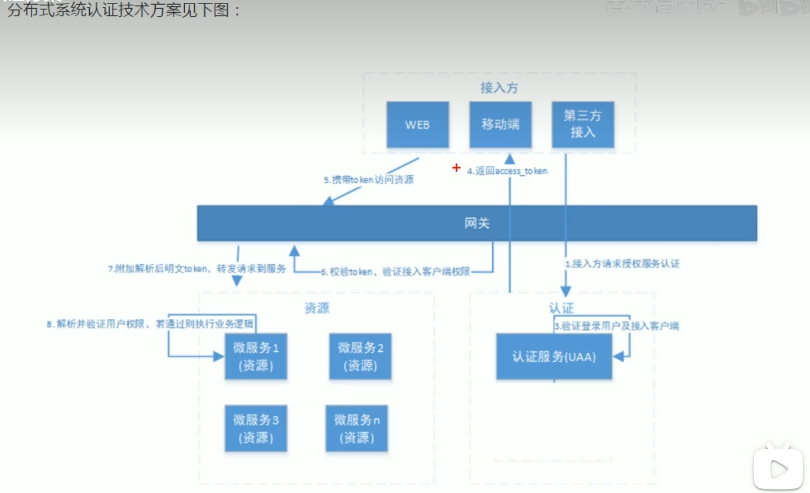
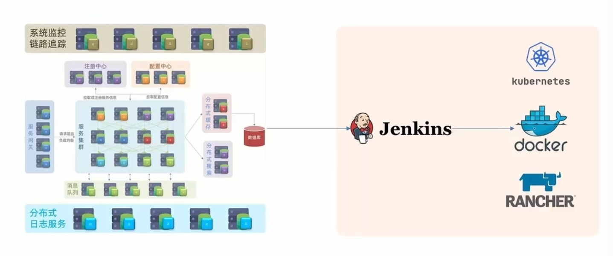
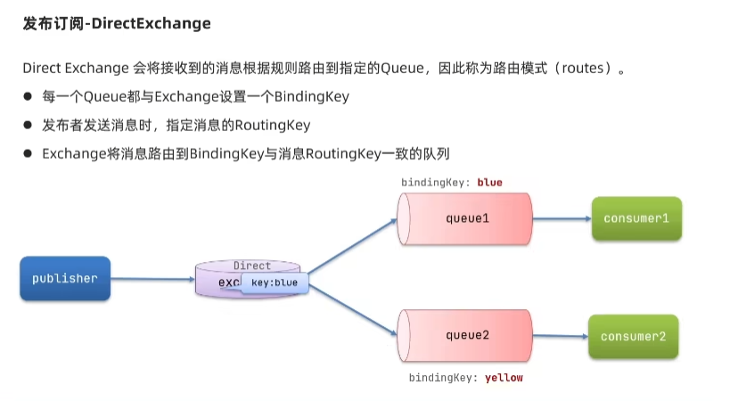
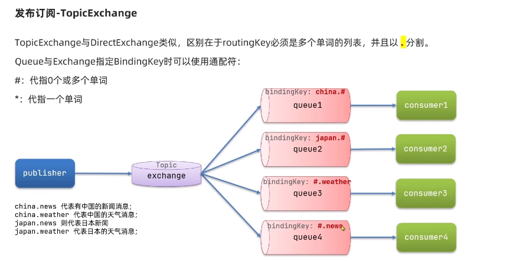
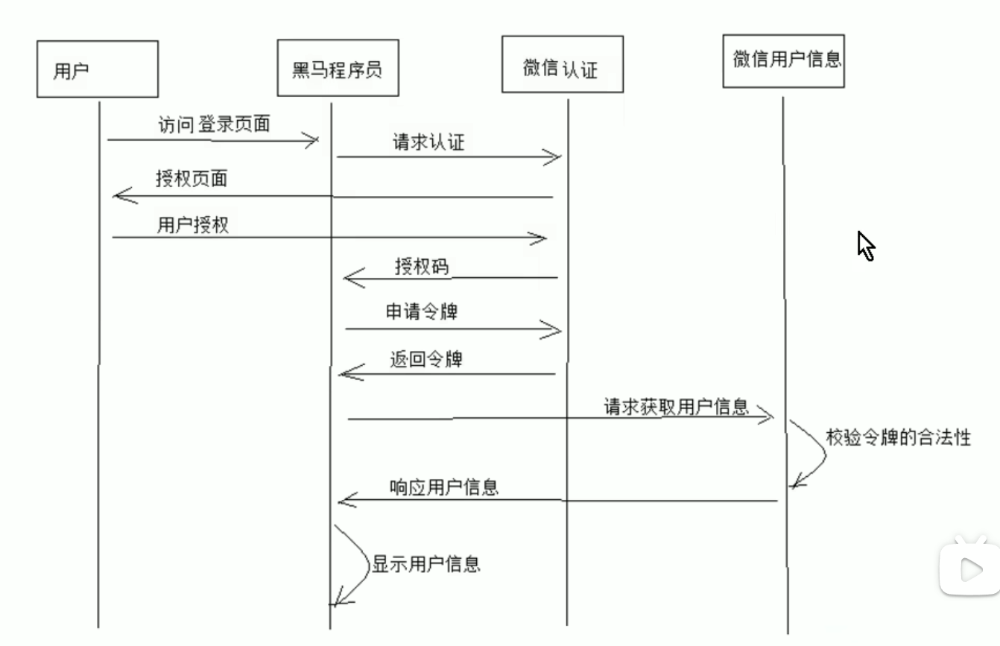
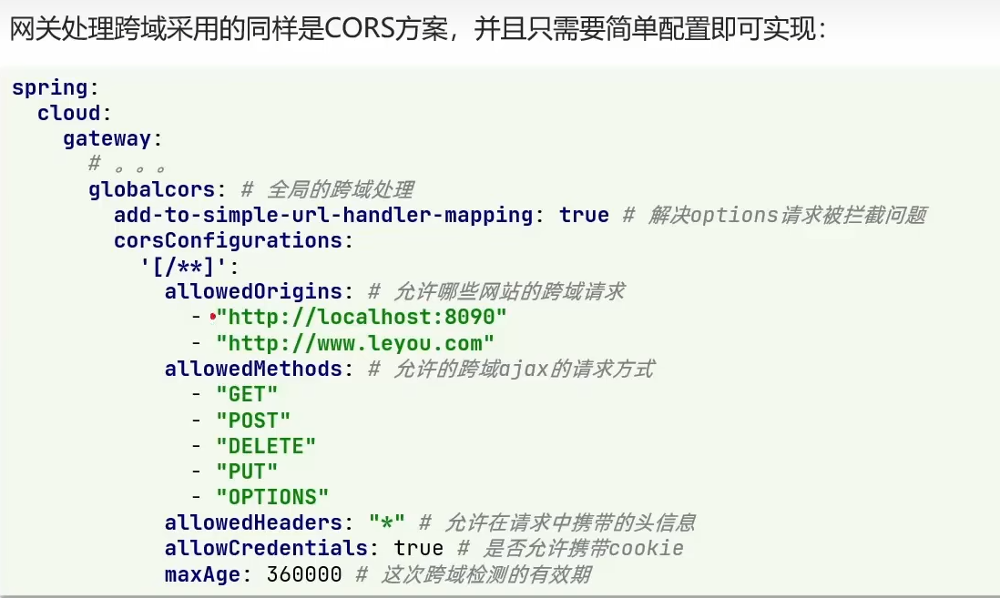
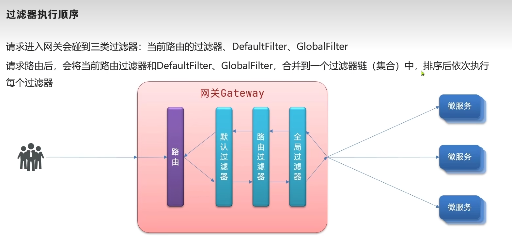
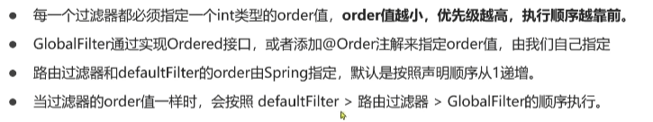
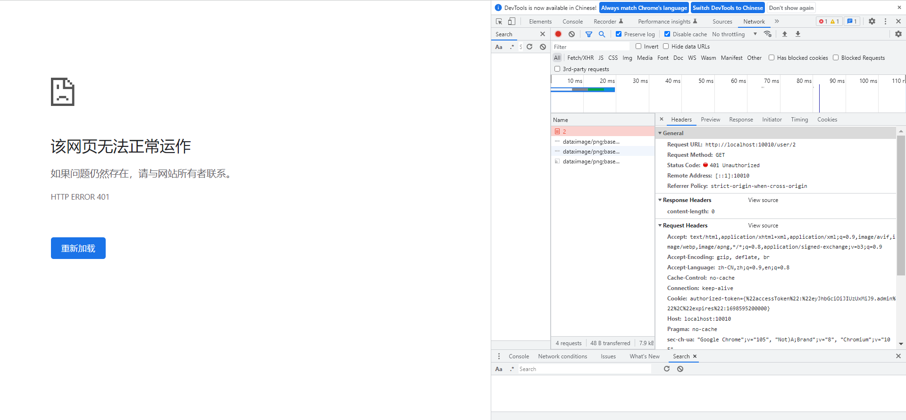
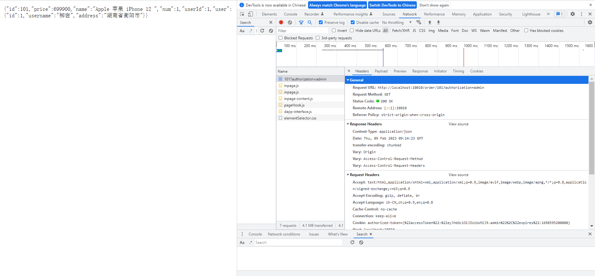

## 项目介绍
本项目使用springcloud技术实现分布式微服务架构，使用技术包含但不限于springcloud+rabbitmq+redis+mysql+docker。通过搭建一个简单的管理，来
演示springcloud的使用、了解springcloud使用最佳实践，以及使用dockercompose来编排容器。

## 分布式微服务架构

## 使用Jekins+Docker进行持续集成

## 项目结构
- eureka-server：注册中心

- feign-api: 远程调用接口

- gateway: 网关服务

- mq-server: 消息队列服务

- order-service: 订单服务

- user-service: 用户服务

## HelloWorld案例
在Cloud-demo工程下，创建一个HelloWorld微服务，并且将其注册到注册中心。

## SpringAmqp
路由模式：
1、fanout模式

2、Direct模式

3、Topic模式

## SpringCloud Gateway

### 使用Gateway解决浏览器跨域问题

### gateway过滤器执行顺序

执行顺序先看order值，order值越小，执行顺序越靠前。order值一样时，按照spring默认的排序进行执行。

### 全局过滤器案例
http://localhost:10010/user/2

由于添加了全局过滤器，所以再请求时，需要给请求头添加 authorization 参数。
http://localhost:10010/user/2?authorization=admin

http://localhost:10010/order/101?authorization=admin

## 使用Docker部署SpringCloud项目

### 流程
1、每个微服务都需要创建一个Dockerfile文件，用于构建镜像
2、使用maven将每个微服务打包成jar包
 - 如果某个微服务依赖了其他微服务，需要先将依赖的微服务打包成jar包，然后再打包当前微服务。
 - 修改pom.xml文件，将scope设置为system，然后在systemPath中指定jar包的路径。
 - 配置maven打包插件，将executable设置为true，这样打包出来的jar包就可以直接运行，将includeSystemScope设置为true，这样就可以将依赖的jar包一起打包进去。
3、编写docker-compose.yml文件，将每个微服务的镜像文件所在的路径配置进去。
4、使用docker-compose up -d命令启动项目。
