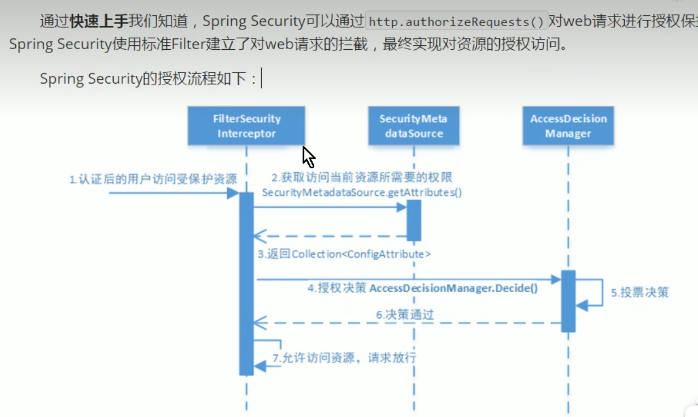
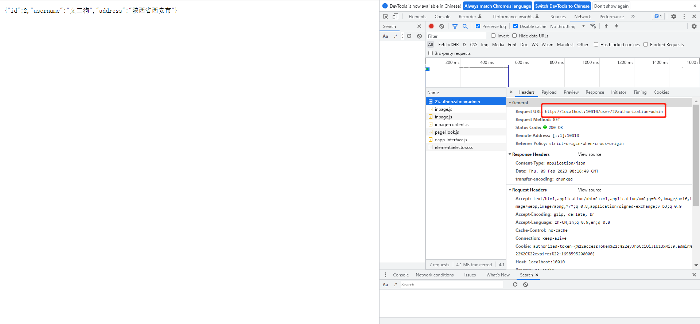
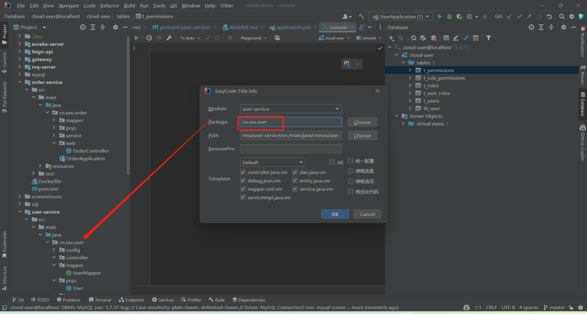

## 项目介绍
本项目使用springcloud技术实现分布式微服务架构，使用技术包含但不限于springcloud+rabbitmq+redis+mysql+docker。通过搭建一个简单的管理，来
演示springcloud的使用、了解springcloud使用最佳实践，以及使用dockercompose来编排容器。

## 分布式微服务架构

## 使用Jekins+Docker进行持续集成

## 项目结构
- eureka-server：注册中心

- feign-api: 远程调用接口

- gateway: 网关服务

- mq-server: 消息队列服务

- order-service: 订单服务

- user-service: 用户服务

## HelloWorld案例
在Cloud-demo工程下，创建一个HelloWorld微服务，并且将其注册到注册中心。

## SpringSecurity认证授权服务
### 什么是认证
认证是指用户登录系统时，系统对用户的身份进行验证，验证通过后，系统才允许用户访问系统资源。
常见的认证方式有：用户名密码认证、短信验证码认证、二维码认证、指纹认证、人脸识别认证、第三方认证等。

### 什么是会话
会话是指用户登录系统后，系统为用户创建的一个会话，会话中包含用户的登录信息，比如用户的登录时间、登录IP、登录设备等。
为了避免用户每次访问系统时都需要登录，系统会将用户的登录信息保存在会话中，当用户再次访问系统时，系统会从会话中获取用户的登录信息，
会话常见的实现方式有：session方式、token等。

- session方式

- token方式

### 什么是授权
授权是指系统对用户的访问资源进行控制，拥有访问权限的用户才能访问系统资源，否则系统会拒绝用户的访问。认证在前，授权在后。

### 授权的数据模型

后续就是基于这五张表来创建认证授权服务。
#### 授权的实现方式
- 基于角色的访问控制（Role-Based Access Control）

- 基于权限的访问控制（Permission-Based Access Control）

所以最佳实践是基于资源的访问控制。

## 创建spring-security认证授权服务
springsecurity相当于升级简化了传统session的写法，并没有使用token。
### 使用场景
单体应用中，用户登录后，将用户信息存储在session中，然后在每个请求中都会携带session信息，这样就可以判断用户是否登录。
在分布式架构中，由于每个微服务都是独立的，所以无法使用session来判断用户是否登录，所以需要使用token来判断用户是否登录。这样就需要
OAuth2.0认证服务来实现。

### springsecurity的认证授权流程

其中核心的类就是UserDetailService，我们就是在这个类里使用账号名去数据库查询用户信息。
如果用户查不到，就返回null即可，springsecurity会自动抛出异常。同时因为他本身就是对session的管理，
而且只适合单体应用，所以对于分布式应用时，security无法适用。
授权流程：

## SpringAmqp
路由模式：
1、fanout模式

2、Direct模式

3、Topic模式

## SpringCloud Gateway

### 使用Gateway解决浏览器跨域问题

### gateway过滤器执行顺序

执行顺序先看order值，order值越小，执行顺序越靠前。order值一样时，按照spring默认的排序进行执行。

### 全局过滤器案例
http://localhost:10010/user/2

由于添加了全局过滤器，所以再请求时，需要给请求头添加 authorization 参数。
http://localhost:10010/user/2?authorization=admin

http://localhost:10010/order/101?authorization=admin

## 使用Docker部署SpringCloud项目

### 流程
1、每个微服务都需要创建一个Dockerfile文件，用于构建镜像
2、使用maven将每个微服务打包成jar包
 - 如果某个微服务依赖了其他微服务，需要先将依赖的微服务打包成jar包，然后再打包当前微服务。
 - 修改pom.xml文件，将scope设置为system，然后在systemPath中指定jar包的路径。
 - 配置maven打包插件，将executable设置为true，这样打包出来的jar包就可以直接运行，将includeSystemScope设置为true，这样就可以将依赖的jar包一起打包进去。
3、编写docker-compose.yml文件，将每个微服务的镜像文件所在的路径配置进去。
4、使用docker-compose up -d命令启动项目。

## SpringBoot代码生成器
打开idea的Settings—》Plugins—》Marketplace，搜索EasyCode，安装并重启idea。
在view--》tool windows--》Database，连接数据库，选择某张数据表，然后右键选择EasyCode--》Generate Code。

参考文章：
https://blog.csdn.net/wo541075754/article/details/105961353