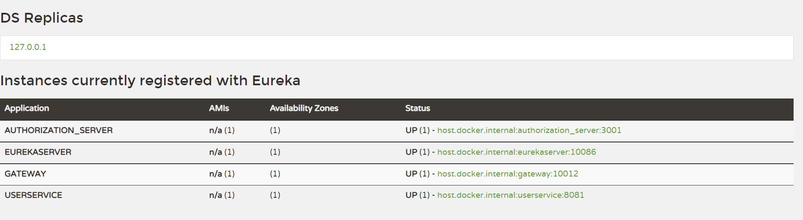
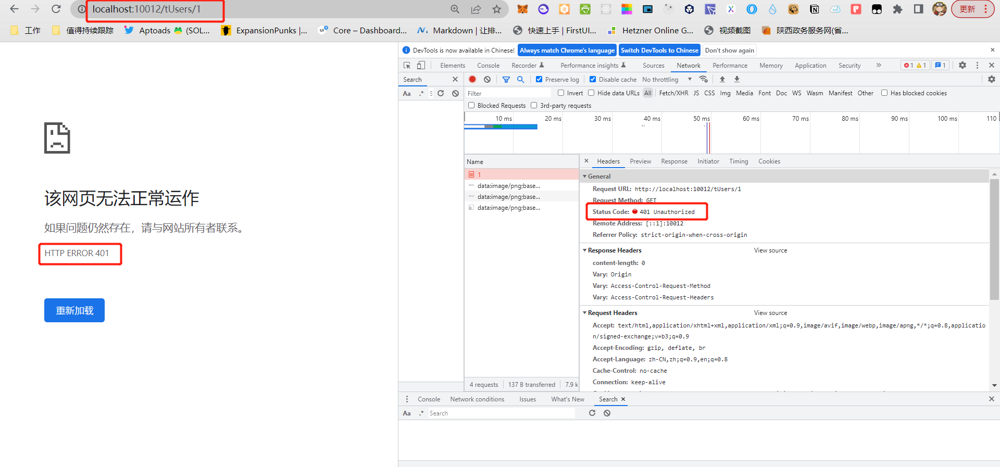
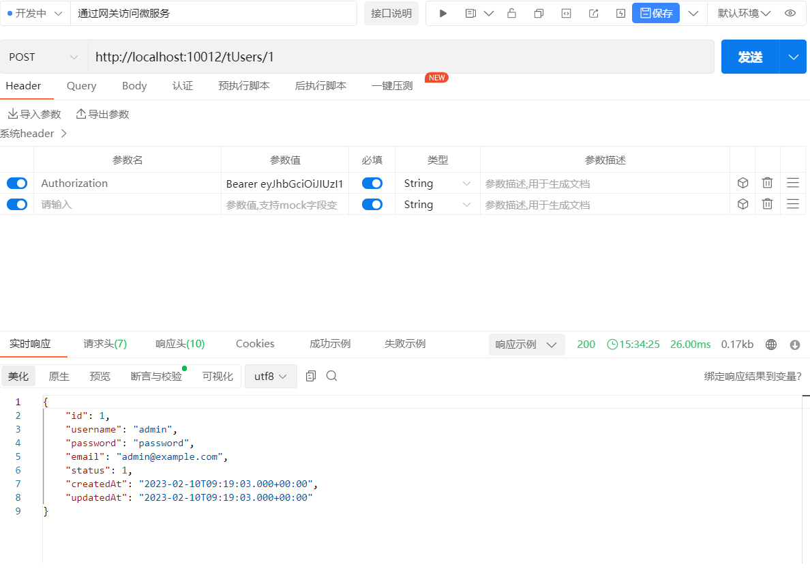

## 必要条件
要测试本项目，需要启动以下服务：
1. eureka
2. user-service
3. gateway
4. uaa-server


## 网关配置
### YML路由规则
```yaml
server:
  port: 10012
spring:
  application:
    name: gateway
  cloud:
    gateway:
      routes:
        - id: user-service # 路由标示，必须唯一
          uri: lb://userservice  # 路由的目标地址   http://localhost:8081/tUsers/1  ===》http://localhost:10012/tUsers/1
          predicates: # 路由断言，判断请求是否符合规则
            - Path=/tUsers/** # 路径断言，判断路径是否是以/user开头，如果是则符合
        - id: order-service
          uri: lb://orderservice
          predicates:
            - Path=/order/**
      default-filters: # 全局过滤器 对多有的路由都生效
        - AddRequestHeader=Truth,Itcast is freaking awesome!
      globalcors: # 全局跨域配置
        add-to-simple-url-handler-mapping: true # 解决Options请求报错
        cors-configurations:
          '[/**]':  #所有的请求都拦截
            allowedOrigins: #允许哪些网站的跨域请求
              - "http://localhost:8090"
              - "http://www.leyou.com"
            allowedMethods: #允许的请求方法
              - "GET"
              - "POST"
              - "PUT"
              - "DELETE"
              - "OPTIONS"
              - "HEAD"
              - "PATCH"
            allowCredentials: true #是否允许发送Cookie
            maxAge: 360000 #跨域检测的有效期，单位为秒


eureka:
  client:
    service-url:  # eureka的地址信息
      defaultZone: http://127.0.0.1:10086/eureka
```
### Filter拦截规则
```java
@Override
    public Mono<Void> filter(ServerWebExchange exchange, GatewayFilterChain chain) {
        // 1.获取请求参数
        ServerHttpRequest request = exchange.getRequest();
        MultiValueMap<String, String> params = request.getQueryParams();

        // 2. 获取请求参数的url
        String url = request.getURI().getPath();
        if (url.indexOf("/oauth") > 0) {
            // 3. 如果是登录请求，直接放行
            return chain.filter(exchange);
        }


        String token = exchange.getRequest().getHeaders().getFirst("Authorization");
        System.out.println("【 token 】 " + token);
        if (token == null) {
            // 拦截请求
            exchange.getResponse().setStatusCode(HttpStatus.UNAUTHORIZED);
            return exchange.getResponse().setComplete();
        }
        token = token.split("\\.")[1];
        byte[] bytes = Base64.getUrlDecoder().decode(token);
        try {
            token = new String(bytes, "UTF-8");
            //解析为json对象
            JSONObject tokenJSON = JSONObject.parseObject(token);
            System.out.println(tokenJSON);

            List<String> scope = tokenJSON.getJSONArray("scope").toJavaList(String.class);

            //访问资源服务1,需要scope1的授权
            if (url.startsWith("/tUsers") && scope.contains("scope1")) {
                return chain.filter(exchange);
            }

            //访问资源服务2,需要scope2的授权
            if (url.startsWith("/tOrders") && scope.contains("scope2")) {
                return chain.filter(exchange);
            }
        } catch (UnsupportedEncodingException e) {
            throw new RuntimeException(e);
        }
        return chain.filter(exchange);
    }
```
## 拦截测试
1、当请求中未携带token时，会被拦截，返回401


2、当请求路径包含/tUsers/**时，会被拦截，转发到userservice服务的/tUsers/**路径下。
