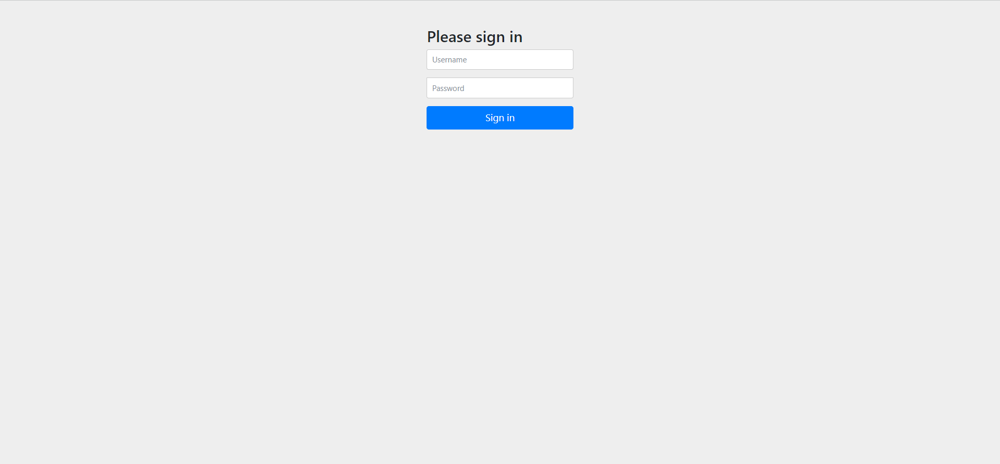
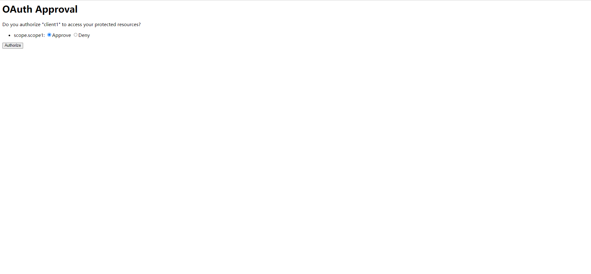
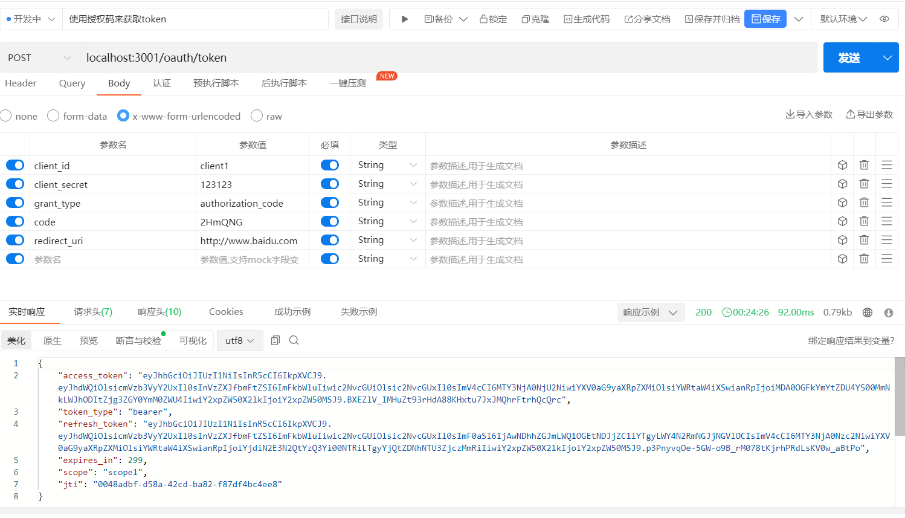
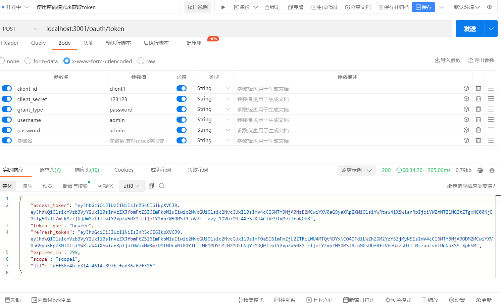
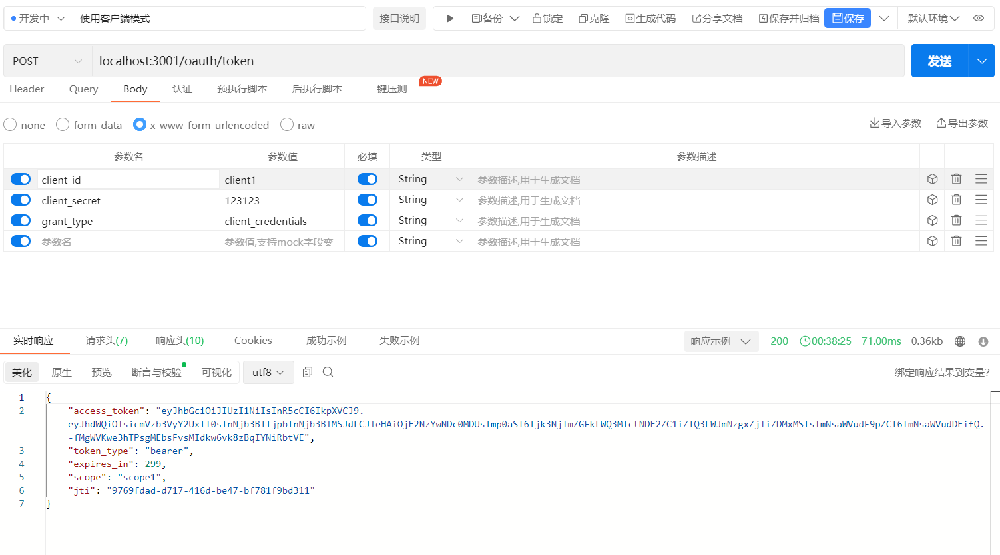

## 测试
### 授权码模式测试
1、使用浏览器打开以下连接 http://127.0.0.1:3001/oauth/authorize?client_id=client1&response_type=code&scope=scope1&redirect_uri=http://www.baidu.com
2、第一次登录，页面会跳转到登录页面(http://127.0.0.1:3001/login)，输入用户名admin/admin，点击登录

3、登录成功后，页面会跳转到授权页面，点击授权

4、授权成功后，页面会跳转到百度页面，地址栏中会带有授权码 https://www.baidu.com/?code=2HmQNG
5、使用授权码获取token

 
### 账号密码模式测试
1、使用postman工具发起POST请求 http://localhost:3001/oauth/token
2、获取token成功

### 客户端模式测试
1、使用postman工具发起POST请求 http://localhost:3001/oauth/token
2、获取token成功

## TODO
1、客户端授权码模式目前是写死在代码中的，后期需要改成从数据库中读取