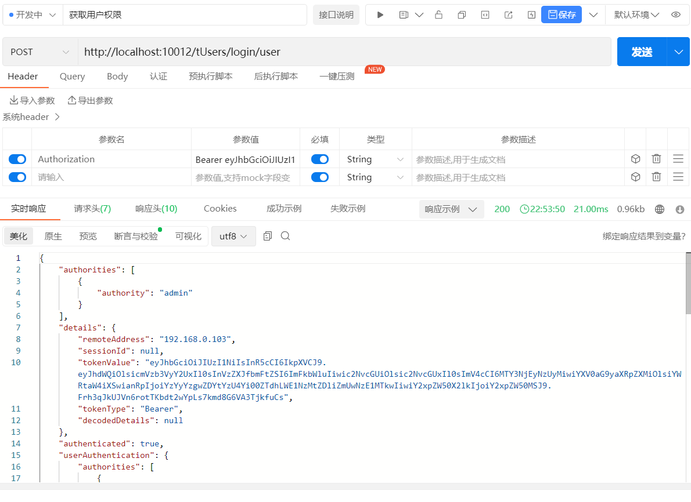

## 登录接口
```javascript
import axios from "axios";

const options = {
method: 'POST',
url: 'http://localhost:10012/tUsers/login',
headers: {'content-type': 'application/x-www-form-urlencoded'},
data: {username: 'admin', password: 'admin'}
};

axios.request(options).then(function (response) {
console.log(response.data);
}).catch(function (error) {
console.error(error);
});
```
登录流程：

用户===》网关服务gateway===》用户中心服务user-service===》统一认证服务uaa-service===》查询数据库。从uaa-service获取JWT令牌，
然后将令牌进行解析后返回给用户。

效果如图：


